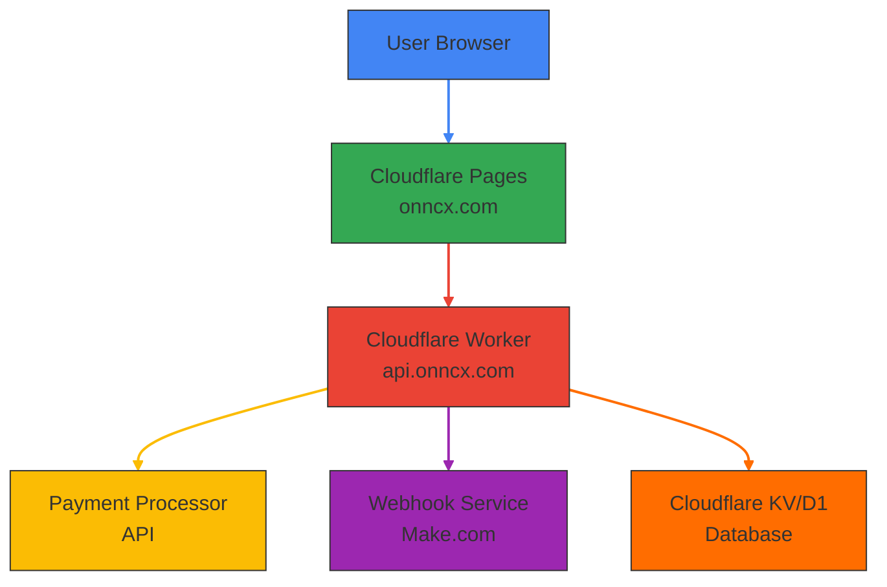

# ONE⚡CASH System Architecture



## Components

### 1. User Browser
- Where users interact with the ONE⚡CASH platform
- Accesses the website through onncx.com

### 2. Cloudflare Pages (Frontend)
- Hosts all static HTML, CSS, and JavaScript files
- Serves the user interface for the exchange platform
- Custom domain: onncx.com

### 3. Cloudflare Worker (Backend)
- Handles API requests for order creation and management
- Custom domain: api.onncx.com
- Processes payment requests and manages order status
- Communicates with external services

### 4. Payment Processor API
- External service for handling cryptocurrency payments
- Integrated with the worker using the provided API key

### 5. Webhook Service (Make.com)
- Receives notifications for order events
- URL: https://hook.eu2.make.com/3DGENEqiuxGMmYaB35alKsswjYlnIhlF

### 6. Cloudflare Storage (KV/D1)
- Persistent storage for order data
- Currently implemented with mock data
- Can be upgraded to use Cloudflare KV or D1 database

## Data Flow

1. **User Interaction**:
   - User visits onncx.com
   - Fills out the exchange form
   - Submits the form to create an order

2. **Order Creation**:
   - Frontend sends POST request to api.onncx.com/api/order
   - Worker validates the request
   - Worker generates order ID and payment address
   - Worker stores order data (mock implementation)
   - Worker sends webhook notification
   - Worker returns order details to frontend

3. **Payment Processing**:
   - Frontend redirects user to payment.html with order ID
   - Payment page polls api.onncx.com/api/order/{id} for status updates
   - User completes payment through external payment processor
   - Payment processor notifies the system (implementation dependent)

4. **Order Completion**:
   - System updates order status to "paid"
   - Payment page detects status change and displays confirmation
   - Webhook notification is sent for order completion

## API Endpoints

### Health Check
```
GET /health
```

### Create Order
```
POST /api/order
```

### Get Order
```
GET /api/order/{order_id}
```

### Update Order Status
```
PUT /api/order/{order_id}
```

## Security Considerations

1. **CORS**: Properly configured CORS headers for cross-origin requests
2. **Input Validation**: Server-side validation of all user inputs
3. **Rate Limiting**: Implementation needed for production environments
4. **Authentication**: Additional authentication for sensitive endpoints in production

## Scalability

1. **Cloudflare Global Network**: Automatic scaling through Cloudflare's CDN
2. **Edge Computing**: Worker runs on Cloudflare's global edge network
3. **Database Scaling**: Cloudflare D1 provides scalable database solution